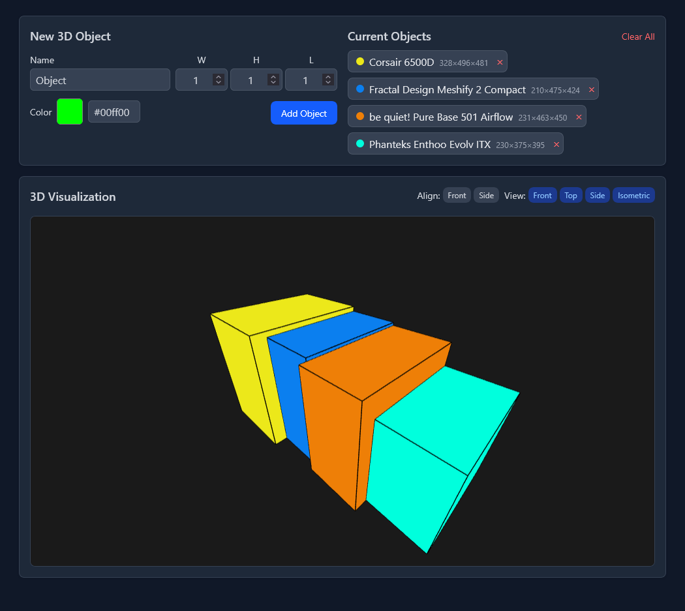

# 3D Object Comparator

*A screenshot of the 3D Object Comparator in action.*

A web application to create and compare 3D objects in a visual environment.

## Features

- Add 3D objects with customizable dimensions and colors.
- View objects from different angles (front, top, side, isometric).
- Align objects along different axes.
- Interactive 3D visualization with orbit controls.
- Save and share configurations via URL.
- Dark/light mode support based on system preferences.

## Installation

To run this application locally:

1. Clone the repository or download the files.
2. Open the `index.html` file in a web browser, or set up a local server (e.g., using Python's http.server).

## Usage

1. **Adding Objects:**
   - Enter a name for the object (default is "Object").
   - Specify the width (W), height (H), and length (L) of the object.
   - Choose a color using the color picker or enter a hex code.
   - Click the "Add Object" button to add the object to the scene.

2. **Viewing Objects:**
   - Use the "View" buttons to change the camera angle:
     - Front: View objects from the front.
     - Top: View objects from the top.
     - Side: View objects from the side.
     - Isometric: View objects in an isometric perspective.

3. **Aligning Objects:**
   - Use the "Align" buttons to arrange objects:
     - Front: Align objects along the X-axis.
     - Side: Align objects along the Z-axis.

4. **Managing Objects:**
   - Objects are listed in the "Current Objects" section.
   - Drag and drop objects in the list to reorder them.
   - Click the '×' button on an object chip to remove it.
   - Use the "Clear All" button to remove all objects.

5. **Sharing Configurations:**
   - The current configuration of objects is encoded in the URL.
   - You can share the URL to share your object configuration with others.
   - When opening a shared URL, the app will load the saved configuration.

## Technologies Used

- [Three.js](https://threejs.org/): A JavaScript library for 3D graphics.
- [SortableJS](https://sortablejs.github.io/Sortable/): For drag-and-drop functionality.
- [Tailwind CSS](https://tailwindcss.com/): For styling the user interface.

## License

MIT

## Acknowledgements

This code was generated with the assistance of AI.
